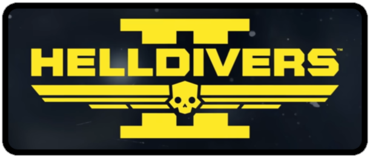

<h1 align="center">
  <p align="center">Helldivers2API-NET</p>
  <a href="#">
    
  </a>
</h1>

<div align="center">
  
[](https://github.com/travis-stanley/Helldivers2API-NET/actions/workflows/dotnet.yml)
[](https://travis-stanley.github.io/Helldivers2API-NET/api/Helldivers2API.html)
</div>

Another open source library for the undocumented [Helldivers2 API](https://store.steampowered.com/app/553850/HELLDIVERS_2/).

🌟 This project reads directly from Helldiver's api. 🌟

### Features
 
* `.NET 7`
* Easy to use
* Built-in cache system
* Consolidates various planet data under a single source
* Leverages the game's api directly, e.g. does not use an intermediary api that may stop working
* Helps spread managed democracy

### Planets, Planets, Planets
The majority of data from the Helldivers2 API is associated to one or more planets.  Because of this, we have made most data retrievable directly from the IPlanet object.  There's no need to jump through multiple requests and pair the data together, this project has done this internally.  

### Overview

All information is retrievable through the convenient `Joel` class.

* Get statistics `added in version 1.1.3`
* Get current assignments, e.g. the `Major Order`
* Get news from the galaxy
* Get status of the on-going war efforts
* Get information of the on-going war
* Get all the known planets in the galaxy, including their
  * Sector
  * Biome
  * Envrionmental conditions (fire storms, etc)  
  * Supply lines to other planets
  * Player count
  * Health / MaxHealth
  * Planets in conflict
  * Original owning faction
  * Current owning faction
  * Factions that claim it as a home world
  * Regen rates
  * Active campaigns
  * Associated planet events
  * Associated global events
  * Associated joint operations
  * etc
 
### Installation

Install the NuGet package via 
the package manager
```NuGet\Install-Package Helldivers2API```
or .NET CLI
```dotnet add package Helldivers2API```

### Getting Started

Get the client by setting the current war id, via `Joel`
```csharp
// The current war id is 801
var hdClient = Helldivers2API.Joel.Instance.SetWarId(801);
```

> [!TIP]
> The war id parameter is required to send requests to the web endpoints, but it does not appear to be advertised anywhere.

> [!WARNING]
> The war id will likely change when the game transitions to the next season.

Get all the known planets
```csharp
var planets = hdClient.GetPlanets();
foreach (var planet in planets)
    Debug.Print($"Planet {planet.Name} resides in the {planet.SectorName} sector");
```

Get all the assignments
```csharp
var assignments = hdClient.GetAssignments();
foreach (var assignment in assignments)
    Debug.Print($"Assignment: {assignment.Brief}");
```

Get all the news
```csharp
var newsfeeds = hdClient.GetLatestNews();
foreach (var newsfeed in newsfeeds)
    Debug.Print($"{newsfeed.Message}");
```

> [!NOTE]
> The information from the WarStatus and WarInfo that relates to a Planet is retrievable from the Planet object directly.

Get the status of the on-going war efforts
```csharp
var warstatus = hdClient.GetWarStatus();  
```

Get information about the war
```csharp
var warinfo = hdClient.GetWarInfo();     
```
